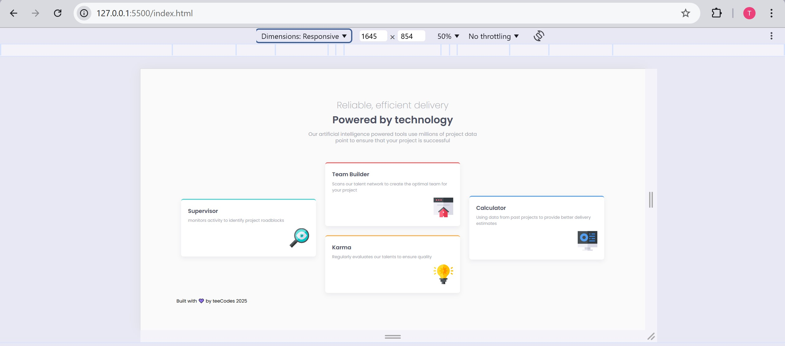

# Frontend Mentor - Four card feature section solution

This is a solution to the [Four card feature section challenge on Frontend Mentor](https://www.frontendmentor.io/challenges/four-card-feature-section-weK1eFYK). Frontend Mentor challenges help you improve your coding skills by building realistic projects. 

## Table of contents

- [Overview](#overview)
  - [The challenge](#the-challenge)
  - [Screenshot](#screenshot)
  - [Links](#links)
- [My process](#my-process)
  - [Built with](#built-with)
  - [What I learned](#what-i-learned)
  - [Continued development](#continued-development)
  - [Useful resources](#useful-resources)
- [Author](#author)
- [Acknowledgments](#acknowledgments)

## Overview

### Screenshot

### Links

- Solution URL: [Github repo to the code for the challenge](https://github.com/AllisonFavour/fm-challenge5)
- Live Site URL: [Vercel link to view the challenge](https://product-preview-card-component-five-zeta.vercel.app/)

## My process

Started by using HTML to give the structure of the layout and having the CSS styling in mind.

my HTML structure consists of main tag which is the parent element and also a child and only element to the body tag. I made use of div with the class name of .main-container

The .main-container is a parent to two div which are named respectively as .img and .card-content, the reason behind this particular structure is to effectively use the css display: flex property and value to achieve the provided design preview.

The .img container is used to display the image on the left for desktop view and at the top for mobile view then the .card-content is on the right for desktop view and bottom for mobile view.

I used the desktop first approach to get the structure and styling looking close to the provided design preview, then i made use of media query to handle for a max-width of 600, using max-width means it will apply to a maximum of 600px and below

Making use of the background-image property i was able to use two images for the desktop and mobile view through media query

### Built with

- Semantic HTML5 markup
- CSS custom properties and Flexbox

### What I learned

I learnt to visualize my solutions first before coding it out. After taking my time to analyse the design image preview of the expected solution, since the Figma file wasnt available to free accounts and then i dived first with building the structure of the layout with HTML.

I learnt it is very important to visualize the HTML structure closely that will also enable our styling process. At first the design image preview looked simple until i started to code it out and i realized it was a bit complex so i had to rewrite my HTML structure having a solid CSS styling process in mind.

I learnt to use SASS (Syntactically Awesome StyleSheets), i had to install Live Sass Compiler which help watch our changes and spot error and then gets compiled to a vanilla CSS file.
Making use of SASS allows some enhanced styling features, i was able to make use of t@ directive which is @import to import fonts from google font, i also learnt and made use variables to store colors and fonts, then i did nesting to help class and structure my elements for styling.

I relearnt how to select elements for styling using :first-of-type, :last-of-type and :nth-of-type() also relearnt media queries

### Continued development

Add accessibility feature and ensure its responsiveness to a variety of screens

## Author

- Website - [Allison Favour](https://allison-favour-portfolio-darkmode.vercel.app/)
- Frontend Mentor - [@AllisonFavour](https://www.frontendmentor.io/profile/AllisonFavour)
- Twitter - [@TrillestOjay](https://x.com/TrillestOjay)

## Acknowledgments

Thanks to myself for starting and finishing this particular project, also thanks to chatgpt and claude ai for the quick reminder and providing code suggestions to boost ideas and help learn on the go.